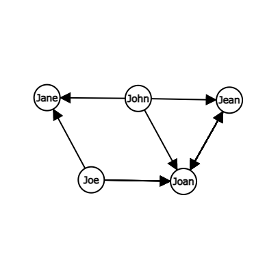

# 演習1
## 1.1
### i
- 点の個数: 6
- 辺の本数: 5
- 各点の次数: A: 1, B: 1, C: 3, D: 3, E: 1, F: 1

### ii
- 点の個数: 5
- 辺の本数: 7
- 各点の次数: P: 2, Q: 4, R: 2, S: 3, T: 3

## 1.2
- 点の個数: 5
- 辺の本数: 7
- 各点の次数: P: 2, Q: 4, R: 2, S: 3, T: 3

## 1.3
### i
Hの次数は常に1、 Cの次数は常に4

### ii

## 1.4

## 1.5

## 1.6

## 1.7
